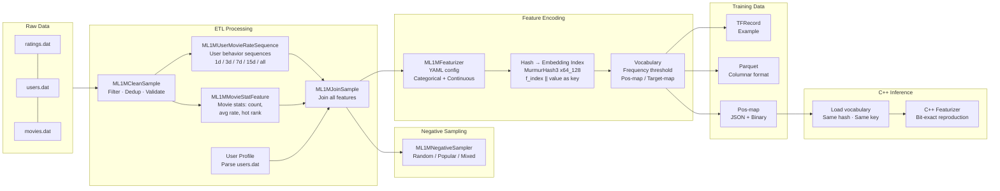
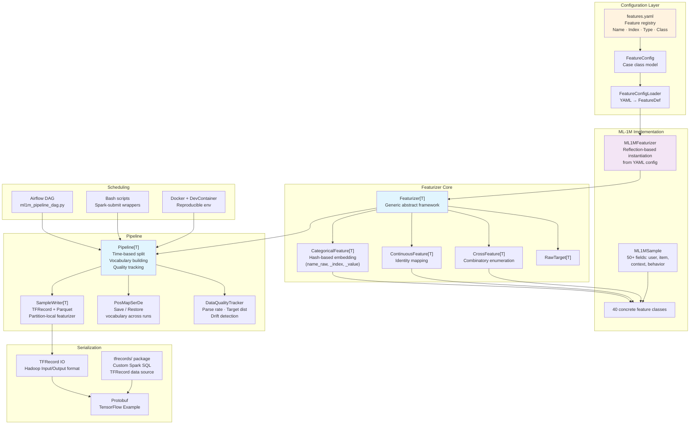

<p align="center">
  
</p>

# gerbil-data

[](LICENSE)
[](https://www.scala-lang.org/)
[](https://spark.apache.org/)
[](https://github.com/shardzhang/gerbil-data/actions/workflows/ci.yml)
[](https://codecov.io/gh/shardzhang/gerbil-data)

A production-grade feature engineering pipeline for recommender systems, built on Apache Spark. It processes raw user-item interaction data through an ETL pipeline, extracts rich features (user demographics, item attributes, context signals, multi-window behavior sequences), and outputs featurized training samples in **TFRecord** and **Parquet** formats — ready for TensorFlow deep learning models.

Currently supports the [MovieLens 1M (ML-1M)](https://grouplens.org/datasets/movielens/1m/) dataset with a modular, extensible architecture designed for easy adaptation to other datasets.

## Features

1. **Data Cleaning and Feature Extraction**: Transforms raw interaction logs into structured training samples — the foundation of recommender system feature engineering. Handles deduplication, anomaly filtering, and multi-table feature joining through Spark SQL, with column-level data quality checks at every stage to eliminate "garbage in, garbage out". Extracts user profiles, item attributes, context signals, and behavior sequences with configurable time windows — covering the full spectrum of features needed for recommendation models. Supports multiple prediction targets: multi-class classification, binary classification, and regression.

2. **Negative Sampling Strategies**: For each positive instance, generates unobserved items as negative samples — a critical component for ranking model training. Supports uniform random, popularity-biased sampling, and hybrid strategies, preventing popular items from dominating training gradients and effectively mitigating the "Matthew effect", improving model generalization on long-tail items.

3. **High-Order Cross Features**: Supports second-order and higher-order feature combinations to capture deeper patterns in data. All 58 features are encoded through a type-safe generic `Featurizer[T]` architecture — producing the standard embedding lookup schema for DeepFM, DIN, and similar models.

4. **Vocabulary Management**: Builds embedding vocabularies through frequency thresholding, assigning dedicated slots for each feature. Feature position maps are persisted in JSON (human-readable) and binary (with mean/std for online normalization).

5. **Feature Configuration**: YAML-driven feature registry. Adding or disabling features requires editing a single config file — no code changes, no recompilation. Supports classpath and external file loading.

6. **Multi-Format Output**: Outputs training samples in TFRecord (TensorFlow Example protobuf) and Parquet (columnar storage) formats, with time-based train/val/test split for standard recommendation evaluation.

7. **Data Quality Monitoring**: Guards against the two silent killers of production recommender systems — training-serving skew and data drift. Automatically detects column-level metrics (null ratios, cardinality, numeric distributions) across ETL stages; tracks parse success rates and target distribution during featurization. Cross-run drift detection compares against historical baselines and alerts when volume, null ratios, or means exceed preset thresholds.

8. **Pipeline Orchestration and Scheduling**: Dual-mode pipeline execution engine. Airflow DAG for production scheduling with automatic retries and monitoring; standalone Python runner for local development and CI. Topological sort ensures stage dependencies are honored. `--dry-run` mode supports execution plan preview.

9. **C++ Online Inference**: A bit-exact C++ reimplementation of the Scala featurizer for latency-critical serving scenarios. Loads the identical vocabulary binary and executes the same MurmurHash3 with matching key concatenation — fundamentally eliminating training-serving skew in production systems. Correctness is verified by golden data diff across tens of thousands of rows.

## Architecture

```
gerbil-data/
├── .devcontainer/               # DevContainer reproducible dev environment
├── assets/                      # Project assets (logo, etc.)
├── bash/                        # Shell scripts for running pipeline steps
│   ├── conf/                    # Environment configuration
│   ├── pipeline/                # Training sample generation scripts
│   │   └── eval/                #   Offline evaluation
│   ├── processing/              # Data preprocessing scripts
│   │   ├── clean/               #   Data cleaning
│   │   ├── feature/             #   Feature extraction
│   │   ├── join/                #   Feature joining
│   │   └── sampling/            #   Negative sampling
│   ├── proto/                   # Protobuf compilation
│   └── tools/                   # Utility scripts
├── dag/                         # Pipeline DAG (Airflow + standalone)
│   ├── ml1m_pipeline_dag.py     # Airflow DAG definition
│   └── run_pipeline.py          # Standalone runner (no Airflow required)
├── docs/                        # Documentation
├── proto/                       # TensorFlow Example protobuf definitions
├── sql/                         # Hive/Spark SQL scripts
├── src/
│   ├── main/
│   │   ├── java/                # Java utilities (TensorFlow Hadoop I/O)
│   │   ├── resources/           # Configuration files (features.yaml)
│   │   └── scala/
│   │       ├── config/          # Config loading & parsing
│   │       ├── processing/      # ETL: raw data → flat intermediate tables
│   │       │   ├── clean/       #   Data cleaning & validation
│   │       │   ├── feature/     #   Feature derivation (stats, sequences)
│   │       │   └── join/        #   Multi-table feature joining
│   │       ├── featurizer/      # ML encoding: features → embedding indices
│   │       │   ├── core/        #   Abstract featurization framework
│   │       │   └── ml1m/        #   ML-1M concrete implementations
│   │       ├── pipeline/        # Orchestration & training sample generation
│   │       │   ├── serde/       #   Serialization (TFRecord, Parquet, pos-map)
│   │       │   └── stats/       #   Online statistics (running value, pos info)
│   │       ├── tfrecords/       # Custom Spark SQL TFRecord data source
│   │       │   ├── serde/       #   Serialization/deserialization
│   │       │   └── udf/         #   User-defined functions
│   │       └── utils/           # Utility functions
│   └── test/                    # Unit tests (mirroring main structure)
│       ├── scala/
│       │   ├── config/
│       │   ├── featurizer/
│       │   ├── pipeline/
│       │   ├── tfrecords/
│       │   └── utils/
│       └── resources/
├── tools/                       # C++ Online Inference Featurizer
│   └── cpp_featurizer/          #   Bit-exact C++ reimplementation
├── Dockerfile                   # Docker build
├── pom.xml                      # Maven build configuration
└── requirements.txt             # Python dependencies
```

### Pipeline Overview



### Component Architecture



## Prerequisites

- **Java** 8+
- **Scala** 2.12
- **Maven** 3.x
- **Apache Spark** 3.4.0
- **protoc** 3.6.0 (for protobuf compilation, optional)

## Quick Start

### 1. Build the project

```bash
mvn clean package -DskipTests
```

### 2. Download the ML-1M dataset

```bash
curl -O https://files.grouplens.org/datasets/movielens/ml-1m.zip
unzip ml-1m.zip
# Set this environment variable for the commands below
export ML1M_HOME=/path/to/unzipped/ml-1m
```

### 3. Run the pipeline

#### Step 1: Clean raw data
```bash
spark-submit --class processing.clean.ML1MCleanSample \
  target/gerbil-data-1.0.0-jar-with-dependencies.jar \
  ${ML1M_HOME}
```

#### Step 2: Extract user behavior sequences
```bash
spark-submit --class processing.feature.ML1MUserMovieRateSequence \
  target/gerbil-data-1.0.0-jar-with-dependencies.jar \
  ${ML1M_HOME}
```

#### Step 3: Compute movie statistics
```bash
spark-submit --class processing.feature.ML1MMovieStatFeature \
  target/gerbil-data-1.0.0-jar-with-dependencies.jar \
  ${ML1M_HOME}
```

#### Step 4: Join all features
```bash
spark-submit --class processing.join.ML1MJoinSample \
  target/gerbil-data-1.0.0-jar-with-dependencies.jar \
  ${ML1M_HOME}
```

#### Step 5: Generate TFRecord / Parquet samples
```bash
spark-submit --class pipeline.ML1MPipeline \
  --conf spark.serializer=org.apache.spark.serializer.JavaSerializer \
  target/gerbil-data-1.0.0-jar-with-dependencies.jar \
  --yesterday <date> \
  --parts <num_partitions> \
  --feature_threshold <threshold> \
  --target_threshold <threshold> \
  --sample_ratio <ratio> \
  --input_dir ${ML1M_HOME} \
  --output_dir /path/to/output \
  --output_format tfrecord
```

### Or run with shell scripts

```bash
# Edit bash/conf/env.sh with your paths
bash bash/processing/clean/ML1MCleanSample.sh
bash bash/processing/feature/ML1MMovieStatFeature.sh
bash bash/processing/feature/ML1MUserMovieRateSequence.sh
bash bash/processing/join/ML1MJoinSample.sh
bash bash/pipeline/ML1MPipeline.sh
```

## Docker / DevContainer

A Docker image with all build dependencies (Java 8, Scala 2.12, Maven, protoc, Python) is provided for a reproducible development environment.

### Build the image (or skip to use pre-built)

```bash
docker build -t gerbil-data .
```

### Interactive shell

```bash
docker run -it --rm -v "$PWD":/workspace gerbil-data bash
```

### Run Maven commands

```bash
docker run --rm -v "$PWD":/workspace gerbil-data mvn compile -DskipTests
```

### VS Code DevContainer

1. Install the **Dev Containers** extension
2. Press `Cmd+Shift+P` → **Dev Containers: Reopen in Container**
3. VS Code will automatically build and enter the container, with Metals (Scala LSP) and all extensions configured

> Spark is not included in the image to keep it lightweight. Mount it at runtime if needed:
> `-v /path/to/spark:/opt/spark`

## Feature Types

### Raw Features

| Category | Features |
|----------|----------|
| User | ID, gender, age, occupation, zip code, rating count, avg rating, rating std, active days |
| Item | ID, title, genres, genre count, rating count, avg rating, hot rank, publish year |
| Context | time hour, time area (morning/afternoon/evening/night), week day, weekend flag |
| Behavior | movie rating sequences (all-time, 1d, 3d, 7d, 15d), genre rating sequences |

### Cross Features (configurable)

- **Second-order**: genre × user genre preference, publish year × age, hot rank × user avg rating, genre × gender, genre × weekend
- **Third-order**: age × gender × genre, publish year × age × occupation, genre × gender × occupation

### Targets

- **Multi-class**: rating (1-5) as categorical target
- **Binary**: rating >= 3 as positive, < 3 as negative
- **Regression**: raw rating value

## Output Formats

### TFRecord
Binary protobuf records in TensorFlow Example format, optimized for TensorFlow model training.

### Parquet
Columnar storage format compatible with Spark and many big data tools.

### Vocabulary Files
- `pos_map.json` — Human-readable structured feature position mapping
- `pos_map.bin` — Binary feature mapping with mean/std for online normalization
- `pos_map.txt` — Field dimension summary in plain text

## Project Modules

| Module | Description |
|--------|-------------|
| `processing` | ETL pipeline: data cleaning, feature derivation, multi-table joining |
| `sampling` | Negative sampling for CTR training (random/popular/mixed) |
| `featurizer` | ML feature encoding: categorical/continuous/cross featurizers, hash/PosMap embedding |
| `pipeline` | Orchestration: sample generation, vocabulary management, TFRecord/Parquet output |
| `config` | YAML-driven feature configuration (SnakeYAML → Scala case classes) |
| `tfrecords` | Custom Spark SQL data source for TFRecord format |
| `utils` | Logging, MurmurHash3, date utilities, protobuf helpers |
| `dag` | Pipeline orchestration: Airflow DAG (production) + standalone Python runner (CI/dev) |
| `bash` | Spark-submit wrapper scripts with environment configuration |
| `sql` | Hive DDL for persistent tables |
| `proto` | TensorFlow Example protobuf definitions |
| `tools` | C++ online inference featurizer + golden data generators |

## Dependencies

- **Apache Spark** 3.4.0 (core, sql, mllib, hive)
- **Scala** 2.12.17
- **Protobuf** 3.6.0
- **Hadoop** 3.3.4
- **TensorFlow Hadoop** (for TFRecord I/O, embedded)

## Contributing

Contributions are welcome! Please read [CONTRIBUTING.md](CONTRIBUTING.md) for guidelines.

## License

This project is licensed under the MIT License — see the [LICENSE](LICENSE) file for details.

## References

- [MovieLens 1M Dataset](https://grouplens.org/datasets/movielens/1m/)
- [TensorFlow Example Protocol](https://github.com/tensorflow/tensorflow/tree/master/tensorflow/core/example)
- [TensorFlow Hadoop](https://github.com/tensorflow/ecosystem/tree/master/hadoop)
- [Spark TensorFlow Connector](https://github.com/tensorflow/ecosystem/tree/master/spark/spark-tensorflow-connector)
