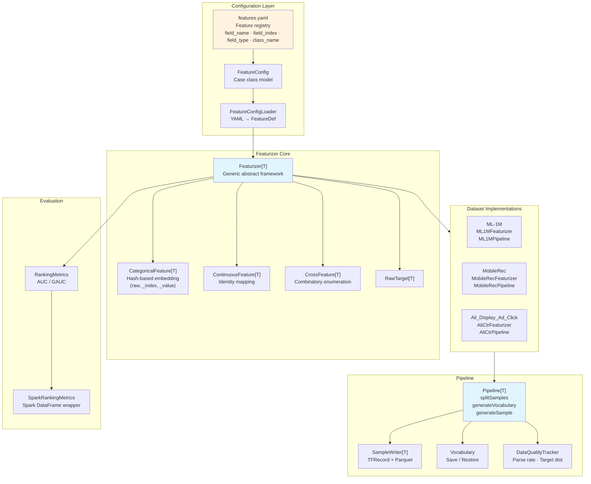

<p align="center">
  
</p>

# gerbil-data

[](LICENSE)
[](https://www.scala-lang.org/)
[](https://spark.apache.org/)
[](https://github.com/shardzhang/gerbil-data/actions/workflows/ci.yml)
[](https://codecov.io/gh/shardzhang/gerbil-data)

A production-grade feature engineering pipeline for recommender systems, built on Apache Spark. It processes raw user-item interaction data through an ETL pipeline, extracts rich features (user profiles, item attributes, context signals, multi-window behavior sequences), and outputs featurized training samples in **TFRecord** and **Parquet** formats — ready for TensorFlow deep learning models.

Currently supports **three datasets** with a modular, extensible architecture:

| Dataset | Domain | Scale (interactions) | Label |
|---------|--------|----------------------|-------|
| [MovieLens 1M (ML-1M)](https://grouplens.org/datasets/movielens/1m/) | Movie ratings | 1M | rating >= 4 → binary / multi-class / regression |
| [MobileRec](https://github.com/mhmaqbool/mobilerec) | App recommendation | 19.3M | rating >= 4 → binary |
| [Ali_Display_Ad_Click](https://tianchi.aliyun.com/dataset/56) | Display ad CTR | 26.6M | native click (0/1) |

## Features

1. **Multi-Dataset Framework**: Modular `Pipeline[T]` abstract class with dataset-specific sample types, featurizers, and ETL processing. Three production datasets supported out of the box: ML-1M (movie recommendations), MobileRec (app install prediction), and Ali_Display_Ad_Click (CTR prediction). Each dataset has its own YAML feature configuration, Scala featurizer classes, and ETL pipeline scripts.

2. **Data Cleaning and Feature Extraction**: Transforms raw interaction logs into structured training samples — the foundation of recommender system feature engineering. Handles deduplication, anomaly filtering, and multi-table feature joining through Spark SQL, with column-level data quality checks at every stage to eliminate "garbage in, garbage out". Extracts user profiles, item attributes, context signals, and behavior sequences with configurable time windows — covering the full spectrum of features needed for recommendation models. Supports multiple prediction targets: multi-class classification, binary classification, and regression.

3. **Negative Sampling Strategies** (ML-1M): For each positive instance, generates unobserved items as negative samples — a critical component for ranking model training. Supports uniform random, popularity-biased sampling, and hybrid strategies, preventing popular items from dominating training gradients and effectively mitigating the "Matthew effect", improving model generalization on long-tail items.

4. **High-Order Cross Features**: Supports second-order and higher-order feature combinations to capture deeper patterns in data. All features are encoded through a type-safe generic `Featurizer[T]` architecture — producing the standard embedding lookup schema for DeepFM, DIN, Wide&Deep, and similar models.

5. **Vocabulary Management**: Builds embedding vocabularies through frequency thresholding, assigning dedicated slots for each feature. Feature position maps are persisted in JSON (human-readable) and binary (with mean/std for online normalization). Supports incremental vocabulary updates across training runs and shared vocabularies across features via `field_index`.

6. **Feature Configuration**: YAML-driven feature registry. Adding or disabling features requires editing a single config file — no code changes, no recompilation. Supports classpath and external file loading. Each dataset has its own YAML config with mode-specific variants (binary/multi).

7. **Multi-Format Output**: Outputs training samples in TFRecord (TensorFlow Example protobuf) and Parquet (columnar storage) formats, with time-based train/val/test split for standard recommendation evaluation.

8. **Data Quality Monitoring**: Guards against the two silent killers of production recommender systems — training-serving skew and data drift. Automatically detects column-level metrics (null ratios, cardinality, numeric distributions) across ETL stages; tracks parse success rates and target distribution during featurization. Cross-run drift detection compares against historical baselines and alerts when volume, null ratios, or means exceed preset thresholds.

9. **C++ Online Inference**: A bit-exact C++ reimplementation of the Scala featurizer for latency-critical serving scenarios. Loads the identical vocabulary binary and executes the same MurmurHash3 with matching key concatenation — fundamentally eliminating training-serving skew in production systems. Correctness is verified by golden data diff across tens of thousands of rows.

## Architecture

```
gerbil-data/
├── .devcontainer/               # DevContainer reproducible dev environment
├── assets/                      # Project assets (logo, etc.)
├── bash/                        # Shell scripts for running pipeline steps
│   ├── conf/                    # Environment configuration
│   ├── pipeline/                # Training sample generation scripts
│   │   └── eval/                #   Offline evaluation (AUC / GAUC)
│   ├── processing/              # Data preprocessing scripts
│   │   ├── clean/               #   Data cleaning
│   │   ├── feature/             #   Feature extraction
│   │   ├── join/                #   Feature joining
│   │   ├── sampling/            #   Negative sampling
│   │   ├── proto/               # Protobuf compilation
│   │   └── tools/               # Utility scripts
│   └── pipeline/                # Pipeline shell scripts
├── dag/                         # Pipeline DAG (Airflow + standalone)
│   ├── ml1m_pipeline_dag.py     # Airflow DAG definition
│   └── run_pipeline.py          # Standalone runner (no Airflow required)
├── docs/                        # Documentation
│   └── dataset/
│       ├── ml_1m/               # ML-1M dataset documentation
│       └── mobile_rec/          # MobileRec dataset documentation
├── proto/                       # TensorFlow Example protobuf definitions
├── sql/                         # Hive/Spark SQL scripts
├── src/
│   ├── main/
│   │   ├── java/                # Java utilities (TensorFlow Hadoop I/O)
│   │   ├── resources/           # Configuration files
│   │   │   ├── ml1m/            #   ML-1M YAML configs
│   │   │   ├── mobilerec/       #   MobileRec YAML configs
│   │   │   └── alictr/          #   Ali_Display_Ad_Click YAML configs
│   │   └── scala/
│   │       ├── config/          # Config loading & parsing
│   │       ├── processing/      # ETL: raw data → flat intermediate tables
│   │       │   ├── clean/       #   Data cleaning (ML1M/MobileRec/AliCtr)
│   │       │   ├── feature/     #   Feature derivation (all datasets)
│   │       │   ├── join/        #   Multi-table joining (all datasets)
│   │       │   └── sampling/    #   Negative sampling
│   │       ├── featurizer/      # ML encoding: features → embedding indices
│   │       │   ├── Featurizer.scala
│   │       │   ├── RawFeature.scala
│   │       │   ├── RawTarget.scala
│   │       │   ├── CategoricalFeature.scala
│   │       │   ├── ContinuousFeature.scala
│   │       │   ├── CrossFeature.scala
│   │       │   ├── ml1m/        #   ML-1M feature implementations
│   │       │   ├── mobilerec/   #   MobileRec feature implementations
│   │       │   └── alictr/      #   AliCtr feature implementations
│   │       ├── pipeline/        # Orchestration & training sample generation
│   │       │   ├── Pipeline.scala
│   │       │   ├── ML1MPipeline.scala
│   │       │   ├── MobileRecPipeline.scala
│   │       │   ├── AliCtrPipeline.scala
│   │       │   ├── serde/       #   Serialization (TFRecord, Parquet, pos-map)
│   │       │   ├── stats/       #   Online statistics
│   │       │   └── eval/        #   AUC / GAUC evaluation
│   │       ├── tfrecords/       # Custom Spark SQL TFRecord data source
│   │       └── utils/           # Utility functions
│   └── test/                    # Unit tests (mirroring main structure)
├── tools/                       # C++ Online Inference Featurizer
│   └── cpp_featurizer/          #   Bit-exact C++ reimplementation
├── Dockerfile                   # Docker build
├── pom.xml                      # Maven build configuration
└── requirements.txt             # Python dependencies
```

### Pipeline Overview

```mermaid
flowchart LR
    subgraph Raw[Raw Data]
        direction TB
        R1[ratings.dat /<br/>mobilerec_final.csv /<br/>raw_sample.csv]
    end

    subgraph ETL[ETL Processing]
        C[CleanSample<br/>Filter · Dedup · Validate]
        S[ItemStatFeature<br/>Item stats: avg, count, price…]
        B[UserBehaviorSequence<br/>Behavior sequences<br/>1d / 3d / 7d / 15d / 30d / all]
        P[UserProfile<br/>Parse user attributes]
        J[JoinSample<br/>Join all features]
    end

    subgraph Sampling[Negative Sampling]
        N[NegativeSampler<br/>Random / Popular / Mixed]
    end

    subgraph Encoding[Feature Encoding]
        F[Featurizer<br/>YAML config<br/>Categorical + Continuous]
        H[Hash → Embedding Index<br/>MurmurHash3 x64_128<br/>f_index || value as key]
        V[Vocabulary<br/>Frequency threshold<br/>Pos-map / Target-map]
    end

    subgraph Train[Training Data]
        T[TFRecord<br/>Example]
        Pq[Parquet<br/>Columnar format]
        Pm[Pos-map<br/>JSON + Binary]
    end

    subgraph Serve[Serving]
        Cp[C++ Featurizer<br/>Bit-exact reproduction]
    end

    Raw --> C --> S & B & P --> J
    J --> N & F
    F --> H --> V
    V --> T & Pq & Pm
    Pm --> Cp
```

### Component Architecture



## Datasets

### ML-1M (MovieLens 1M)

Movie rating dataset with 1M interactions, 6040 users, 3706 movies. Features include user demographics (gender, age, occupation), item attributes (title, genres, release year), multi-window behavior sequences, and context signals.

**ETL Pipeline** (in order):

| Step | Script | Class | Description |
|------|--------|-------|-------------|
| 1 | `bash/processing/clean/ML1MCleanSample.sh` | `processing.clean.ML1MCleanSample` | Clean & deduplicate ratings |
| 2 | `bash/processing/feature/ML1MUserMovieRateSequence.sh` | `processing.feature.ML1MUserMovieRateSequence` | Build user behavior sequences |
| 3 | `bash/processing/feature/ML1MMovieStatFeature.sh` | `processing.feature.ML1MMovieStatFeature` | Compute movie statistics |
| 4 | `bash/processing/join/ML1MJoinSample.sh` | `processing.join.ML1MJoinSample` | Join all features |
| 5 | `bash/pipeline/ML1MPipelineBinary.sh` | `pipeline.ML1MPipeline` | Generate TFRecord / Parquet |

### MobileRec

Large-scale app recommendation dataset with 19.3M interactions, 700K users, 10K apps. Rating-based with app store metadata (category, price, reviews, content rating).

**ETL Pipeline**:

| Step | Script | Class |
|------|--------|-------|
| 1 | `bash/processing/clean/MobileRecCleanSample.sh` | `processing.clean.MobileRecCleanSample` |
| 2 | `bash/processing/feature/MobileRecAppStatFeature.sh` | `processing.feature.MobileRecAppStatFeature` |
| 3 | `bash/processing/feature/MobileRecUserBehaviorSequence.sh` | `processing.feature.MobileRecUserBehaviorSequence` |
| 4 | `bash/processing/join/MobileRecJoinSample.sh` | `processing.join.MobileRecJoinSample` |
| 5 | `bash/pipeline/MobileRecPipelineBinary.sh` | `pipeline.MobileRecPipeline` |

### Ali_Display_Ad_Click (AliCtr)

Real-world display advertising CTR dataset with 26.6M impressions, 1.14M users, 847K ad groups. Native click labels (0/1), user profiles (gender, age, shopping level), and ad hierarchy (campaign, customer, brand, category).

**ETL Pipeline**:

| Step | Script | Class |
|------|--------|-------|
| 1 | `bash/processing/clean/AliCtrCleanSample.sh` | `processing.clean.AliCtrCleanSample` |
| 2 | `bash/processing/feature/AliCtrItemStatFeature.sh` | `processing.feature.AliCtrItemStatFeature` |
| 3 | `bash/processing/feature/AliCtrUserProfileFeature.sh` | `processing.feature.AliCtrUserProfileFeature` |
| 4 | `bash/processing/feature/AliCtrUserBehaviorSequence.sh` | `processing.feature.AliCtrUserBehaviorSequence` |
| 5 | `bash/processing/feature/AliCtrJoinSample.sh` | `processing.feature.AliCtrJoinSample` |
| 6 | `bash/pipeline/AliCtrPipelineBinary.sh` | `pipeline.AliCtrPipeline` |

## Evaluation

Ranking metrics are provided in the `pipeline.eval` package:

| Class | Description |
|-------|-------------|
| `RankingMetrics` | Pure Scala AUC / GAUC computation, no Spark dependency |
| `SparkRankingMetrics` | Spark DataFrame wrapper with CLI entry point |

```bash
# Evaluate model predictions (Parquet with target + score columns)
bash bash/pipeline/eval/RankingMetrics.sh
```

## Quick Start

### 1. Build the project

```bash
mvn clean package -DskipTests
```

### 2. Download a dataset

```bash
# ML-1M
curl -O https://files.grouplens.org/datasets/movielens/ml-1m.zip && unzip ml-1m.zip

# or MobileRec / Ali_Display_Ad_Click (see docs/dataset/ for instructions)
```

### 3. Run the ETL + pipeline

```bash
# Edit bash/conf/env.sh with your paths
source bash/conf/env.sh

# ML-1M
bash bash/processing/clean/ML1MCleanSample.sh
bash bash/processing/feature/ML1MUserMovieRateSequence.sh
bash bash/processing/feature/ML1MMovieStatFeature.sh
bash bash/processing/join/ML1MJoinSample.sh
bash bash/pipeline/ML1MPipelineBinary.sh

# MobileRec
bash bash/processing/clean/MobileRecCleanSample.sh
bash bash/processing/feature/MobileRecAppStatFeature.sh
bash bash/processing/feature/MobileRecUserBehaviorSequence.sh
bash bash/processing/join/MobileRecJoinSample.sh
bash bash/pipeline/MobileRecPipelineBinary.sh

# AliCtr
bash bash/processing/clean/AliCtrCleanSample.sh
bash bash/processing/feature/AliCtrItemStatFeature.sh
bash bash/processing/feature/AliCtrUserProfileFeature.sh
bash bash/processing/feature/AliCtrUserBehaviorSequence.sh
bash bash/processing/feature/AliCtrJoinSample.sh
bash bash/pipeline/AliCtrPipelineBinary.sh
```

## Feature Types

### Raw Features

| Category | ML-1M | MobileRec | AliCtr |
|----------|-------|-----------|--------|
| User | gender, age, occupation, zip code, rating stats | user behavior stats (active days, avg rating, std) | cms_segid, gender, age_level, pvalue_level, shopping_level, occupation |
| Item | title, genres, rating count, avg rating, hot rank, release year | app package, category, price, avg rating, review count, content rating | adgroup_id, cate_id, campaign_id, customer, brand, price |
| Context | time hour, time area, week day | time hour, time area, week day | pid (position), time hour, time area, week day |
| Behavior | movie rating sequences (multi-window), genre rating sequences | app rating sequences (multi-window), category rating sequences | ad impression/click history sequence |

### Cross Features (configurable per dataset)

Each dataset supports cross features like `category_xx_user_category`, `gender_xx_age`, etc., defined in its YAML config.

### Targets

Select the prediction target with `--target_mode` when running the pipeline:

| Mode | CLI Value | ML-1M | MobileRec / AliCtr |
|------|-----------|-------|--------------------|
| **Binary** | `binary` | rating >= 3 → positive | rating >= 4 → positive / native clk |
| **Multi-class** | `multi` | rating (1-5) as classes | app/adgroup_id as classes |
| **Regression** | `rating` | raw rating value | N/A |

## Output Formats

### TFRecord
Binary protobuf records in TensorFlow Example format, optimized for TensorFlow model training.

### Parquet
Columnar storage format compatible with Spark and many big data tools.

### Vocabulary Files
- `pos_map.json` — Human-readable structured feature position mapping
- `pos_map.bin` — Binary feature mapping with mean/std for online normalization
- `pos_map.txt` — Field dimension summary in plain text

## Feature Configuration

Features are registered in YAML (`src/main/resources/{dataset}/*.yaml`). Each feature entry specifies:

| Key | Description |
|-----|-------------|
| `field_name` | Globally unique feature name (used as prefix for TFRecord fields) |
| `field_index` | Numeric index; features sharing the same `field_index` share an embedding vocabulary |
| `field_type` | `1` for categorical (hash-based), `0` for continuous (identity mapping) |
| `class_name` | Scala class that implements the feature extraction logic |
| `enabled` | Whether the feature is active (`true`/`false`) |

```yaml
features:
  - {field_name: user_id,       field_index: 1,   field_type: 1, class_name: UserID,       enabled: true}
  - {field_name: user_age,      field_index: 2,   field_type: 1, class_name: UserAge,      enabled: true}
  - {field_name: movie_id,      field_index: 101, field_type: 1, class_name: MovieID,      enabled: true}

  # Behavior sequences share field_index 101 (same vocabulary as movie_id)
  - {field_name: user_movie_rate,    field_index: 101, field_type: 1, class_name: UserMovieRate,    enabled: true}
```

### Shared Vocabulary

Features sharing the same `field_index` share a single embedding vocabulary (pos-map). The position counter is unified across all features using that `field_index`, ensuring each unique feature value gets a unique embedding slot — even when the value appears in multiple related features.

For example, `adgroup_id`, `user_history_ad_seq` all share `field_index=101` in AliCtr. The ad "12345" maps to the same embedding position whether it appears as the target ad or in the user's history sequence.

### Field Naming Convention

Each feature produces three TFRecord fields:
- `{field_name}_raw` — string representation
- `{field_name}_index` — embedding position (pos-map lookup or hashed)
- `{field_name}_value` — embedding weight

## Project Modules

| Module | Description |
|--------|-------------|
| `processing` | ETL pipeline: data cleaning, feature derivation, multi-table joining |
| `featurizer` | ML feature encoding: categorical/continuous/cross featurizers, hash/PosMap embedding |
| `pipeline` | Orchestration: sample generation, vocabulary management, TFRecord/Parquet output |
| `pipeline.eval` | Ranking metrics: AUC / GAUC computation (pure Scala + Spark wrappers) |
| `config` | YAML-driven feature configuration (SnakeYAML → Scala case classes) |
| `tfrecords` | Custom Spark SQL data source for TFRecord format |
| `utils` | Logging, MurmurHash3, date utilities |
| `dag` | Pipeline orchestration: Airflow DAG (production) + standalone Python runner (CI/dev) |
| `bash` | Spark-submit wrapper scripts with environment configuration |
| `tools` | C++ online inference featurizer + golden data generators |

## Prerequisites

- **Java** 8+
- **Scala** 2.12
- **Maven** 3.x
- **Apache Spark** 3.4.0
- **protoc** 3.6.0 (for protobuf compilation, optional)

## Python Setup

```bash
cd $PROJECT_HOME
python3.11 -m venv .venv
source .venv/bin/activate
pip install -r requirements.txt
```

## Docker / DevContainer

```bash
docker build -t gerbil-data .
docker run -it --rm -v "$PWD":/workspace gerbil-data bash
```

## Dependencies

- **Apache Spark** 3.4.0 (core, sql, mllib, hive)
- **Scala** 2.12.17
- **Protobuf** 3.6.0
- **Hadoop** 3.3.4
- **TensorFlow Hadoop** (for TFRecord I/O, embedded)

## Contributing

Contributions are welcome! Please read [CONTRIBUTING.md](CONTRIBUTING.md) for guidelines.

## License

This project is licensed under the MIT License — see the [LICENSE](LICENSE) file for details.

## References

- [MovieLens 1M Dataset](https://grouplens.org/datasets/movielens/1m/)
- [MobileRec: A Large-Scale Dataset for Mobile Apps Recommendation](https://arxiv.org/abs/2303.06588)
- [Ali_Display_Ad_Click Dataset](https://tianchi.aliyun.com/dataset/56)
- [TensorFlow Example Protocol](https://github.com/tensorflow/tensorflow/tree/master/tensorflow/core/example)
- [TensorFlow Hadoop](https://github.com/tensorflow/ecosystem/tree/master/hadoop)
- [Spark TensorFlow Connector](https://github.com/tensorflow/ecosystem/tree/master/spark/spark-tensorflow-connector)
