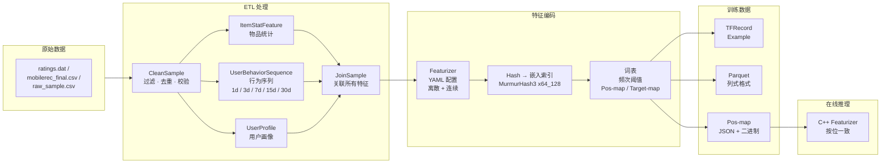
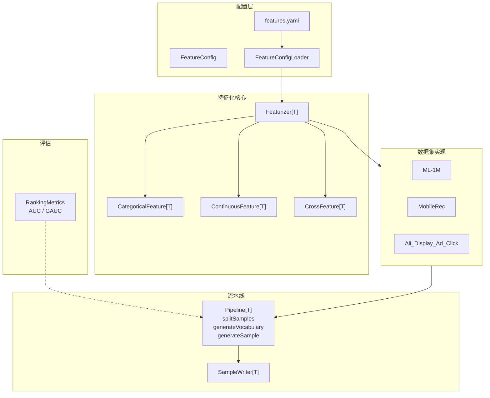

<p align="center">
  
</p>

# gerbil-data

[](LICENSE)
[](https://www.scala-lang.org/)
[](https://spark.apache.org/)
[](https://github.com/shardzhang/gerbil-data/actions/workflows/ci.yml)
[](https://codecov.io/gh/shardzhang/gerbil-data)

基于 Apache Spark 的生产级推荐系统特征工程 pipeline。处理原始用户-物品交互数据，通过 ETL pipeline 提取丰富特征（用户画像、物品属性、上下文信号、多时间窗口行为序列），输出 **TFRecord** 和 **Parquet** 格式的特征化训练样本，可直接用于 TensorFlow 深度学习模型训练。

目前支持 **三个数据集**，模块化可扩展架构：

| 数据集 | 领域 | 规模（交互数） | 标签 |
|--------|------|---------------|------|
| [MovieLens 1M (ML-1M)](https://grouplens.org/datasets/movielens/1m/) | 电影评分 | 100 万 | rating >= 4 → 二分类 / 多分类 / 回归 |
| [MobileRec](https://github.com/mhmaqbool/mobilerec) | App 推荐 | 1930 万 | rating >= 4 → 二分类 |
| [Ali_Display_Ad_Click](https://tianchi.aliyun.com/dataset/56) | 展示广告 CTR | 2656 万 | 原生点击 (0/1) |

## 功能特性

1. **多数据集框架**：泛型 `Pipeline[T]` 抽象类，数据集通过各自的 Sample 类型、Featurizer 和 ETL 处理逻辑实现。内置三个生产级数据集：ML-1M（电影推荐）、MobileRec（App 安装预测）、Ali_Display_Ad_Click（CTR 预测）。每个数据集有独立的 YAML 特征配置、Scala 特征类和 ETL 脚本。

2. **数据清洗与特征提取**：将原始交互日志加工为结构化训练样本。基于 Spark SQL 完成去重、异常过滤、多表特征 Join，各阶段内置列级数据质量检查。提取用户画像、物品属性、上下文信号、可配置时间窗口的行为序列。支持多种预测目标。

3. **负采样策略**（ML-1M）：为每条正样本生成该用户未交互的物品作为负样本。支持均匀随机、流行度偏置、混合三种采样策略，缓解"马太效应"。

4. **高阶交叉特征**：支持二阶及以上高阶特征组合。全部特征通过类型安全的泛型 `Featurizer[T]` 架构编码，产出 DeepFM、DIN、Wide&Deep 等模型的标准 embedding lookup 格式。

5. **词表管理**：基于频次阈值构建 embedding 词表。特征位置映射持久化为 JSON（人类可读）和二进制（含均值/标准差，用于在线归一化）。支持跨运行增量更新和通过 `field_index` 实现词表共享。

6. **特征配置化**：YAML 驱动的特征注册中心。新增或禁用特征只需编辑一个配置文件，无需改代码、无需重编译。每个数据集有独立的 YAML 配置和模式变体（binary/multi）。

7. **多格式输出**：TFRecord（TensorFlow Example protobuf）和 Parquet（列式存储），按时间切分 train/val/test。

8. **数据质量监控**：自动检测各阶段的空值率、基数、数值分布等列级指标；追踪解析成功率和目标分布。跨运行漂移检测自动对比历史基线。

9. **C++ 在线推理**：与 Scala 训练侧按位一致的 C++ 特征重实现，加载完全相同词表，执行相同 MurmurHash3 和键拼接逻辑，消除训练-服务不一致。

10. **AUC / GAUC 评估**：内置 `RankingMetrics` 纯 Scala 实现 + `SparkRankingMetrics` DataFrame 封装，支持离线模型评估。

## 项目架构

```
gerbil-data/
├── bash/                        # 执行 pipeline 步骤的 Shell 脚本
│   ├── conf/                    # 环境配置
│   ├── pipeline/                # 训练样本生成 + 评估脚本
│   │   └── eval/                #   离线评估（AUC / GAUC）
│   ├── processing/              # 数据预处理脚本
│   │   ├── clean/               #   数据清洗（各数据集）
│   │   ├── feature/             #   特征提取（各数据集）
│   │   ├── join/                #   特征关联（各数据集）
│   │   └── sampling/            #   负采样
│   └── tools/                   # 工具脚本
├── dag/                         # Pipeline DAG（Airflow + 独立运行）
├── docs/                        # 文档
│   └── dataset/
│       ├── ml_1m/               # ML-1M 数据集说明
│       └── mobile_rec/          # MobileRec 数据集说明
├── src/
│   ├── main/
│   │   ├── resources/           # YAML 特征配置
│   │   │   ├── ml1m/            #   ML-1M 配置
│   │   │   ├── mobilerec/       #   MobileRec 配置
│   │   │   └── alictr/          #   AliCtr 配置
│   │   └── scala/
│   │       ├── config/          # YAML 加载与解析
│   │       ├── processing/      # ETL：各数据集处理
│   │       │   ├── clean/       #   数据清洗
│   │       │   ├── feature/     #   特征衍生
│   │       │   └── join/        #   多表关联
│   │       ├── featurizer/      # 特征编码器
│   │       │   ├── Featurizer.scala
│   │       │   ├── RawFeature.scala
│   │       │   ├── RawTarget.scala
│   │       │   ├── CategoricalFeature.scala
│   │       │   ├── ContinuousFeature.scala
│   │       │   ├── CrossFeature.scala
│   │       │   ├── ml1m/        #   ML-1M 实现
│   │       │   ├── mobilerec/   #   MobileRec 实现
│   │       │   └── alictr/      #   AliCtr 实现
│   │       ├── pipeline/        # 编排与训练样本生成
│   │       │   ├── Pipeline.scala
│   │       │   ├── ML1MPipeline.scala
│   │       │   ├── MobileRecPipeline.scala
│   │       │   ├── AliCtrPipeline.scala
│   │       │   ├── serde/       #   序列化
│   │       │   ├── stats/       #   统计
│   │       │   └── eval/        #   AUC / GAUC 评估
│   │       ├── tfrecords/       # 自定义 TFRecord 数据源
│   │       └── utils/           # 工具函数
│   └── test/                    # 单元测试
├── tools/                       # C++ 在线推理
└── proto/                       # Protobuf 定义
```

### Pipeline 数据流



### 组件架构



## 数据集

### ML-1M

100 万电影评分，6040 用户，3706 电影。含用户画像（性别/年龄/职业）、物品属性（标题/类型/年份）、多窗口行为序列和上下文特征。

ETL 流程：`ML1MCleanSample` → `ML1MUserMovieRateSequence` → `ML1MMovieStatFeature` → `ML1MJoinSample` → `ML1MPipeline`

### MobileRec

1930 万 App 交互，70 万用户，1 万 App。基于评分，含商店元数据（分类/价格/评论数/内容分级）。

ETL 流程：`MobileRecCleanSample` → `MobileRecAppStatFeature` → `MobileRecUserBehaviorSequence` → `MobileRecJoinSample` → `MobileRecPipeline`

### Ali_Display_Ad_Click（AliCtr）

2656 万展示广告曝光，114 万用户，84.7 万广告组。原生点击标签（0/1），含用户画像（性别/年龄/购物力）和广告层级（活动/广告主/品牌/类目）。

ETL 流程：`AliCtrCleanSample` → `AliCtrItemStatFeature` → `AliCtrUserProfileFeature` → `AliCtrUserBehaviorSequence` → `AliCtrJoinSample` → `AliCtrPipeline`

## AUC / GAUC 评估

| 类 | 说明 |
|---|---|
| `RankingMetrics` | 纯 Scala AUC / GAUC 计算，无 Spark 依赖 |
| `SparkRankingMetrics` | Spark DataFrame 封装，支持 CLI |

```bash
bash bash/pipeline/eval/RankingMetrics.sh
```

## 快速开始

### 1. 构建项目

```bash
mvn clean package -DskipTests
```

### 2. 编辑环境配置

```bash
# 根据你的路径修改 bash/conf/env.sh
# 主要配置：数据路径、Spark 安装目录
```

### 3. 运行 Pipeline

```bash
source bash/conf/env.sh

# ML-1M
bash bash/processing/clean/ML1MCleanSample.sh
bash bash/processing/feature/ML1MUserMovieRateSequence.sh
bash bash/processing/feature/ML1MMovieStatFeature.sh
bash bash/processing/join/ML1MJoinSample.sh
bash bash/pipeline/ML1MPipelineBinary.sh

# MobileRec
bash bash/processing/clean/MobileRecCleanSample.sh
bash bash/processing/feature/MobileRecAppStatFeature.sh
bash bash/processing/feature/MobileRecUserBehaviorSequence.sh
bash bash/processing/join/MobileRecJoinSample.sh
bash bash/pipeline/MobileRecPipelineBinary.sh

# AliCtr
bash bash/processing/clean/AliCtrCleanSample.sh
bash bash/processing/feature/AliCtrItemStatFeature.sh
bash bash/processing/feature/AliCtrUserProfileFeature.sh
bash bash/processing/feature/AliCtrUserBehaviorSequence.sh
bash bash/processing/feature/AliCtrJoinSample.sh
bash bash/pipeline/AliCtrPipelineBinary.sh
```

## 特征类型

### 原始特征

| 类别 | ML-1M | MobileRec | AliCtr |
|------|-------|-----------|--------|
| 用户 | 性别/年龄/职业/评分统计 | 行为统计（活跃天/均分/方差） | cms_segid/性别/年龄/消费力/购物力/职业 |
| 物品 | 标题/类型/评分次/均分/热度/年份 | 包名/分类/价格/均分/评论数/内容分级 | 广告ID/类目/活动/客户/品牌/价格 |
| 上下文 | 小时/时段/星期 | 小时/时段/星期 | 广告位(pid)/小时/时段/星期 |
| 行为 | 电影评分序列(多窗口)、类型序列 | App评分序列(多窗口)、分类序列 | 广告曝光点击序列 |

### 交叉特征（每个数据集可配）

在各自的 YAML 配置中定义，如 `category_xx_user_category`、`gender_xx_age` 等。

### 预测目标

| 模式 | ML-1M | MobileRec / AliCtr |
|------|-------|--------------------|
| **二分类** | rating >= 3 → 1 | rating >= 4 → 1 / 原生 clk |
| **多分类** | 评分 1-5 | app/adgroup_id |
| **回归** | 原始评分 | N/A |

## 特征配置

YAML 示例（`src/main/resources/{dataset}/binary_features.yaml`）：

```yaml
features:
  - {field_name: user_id,    field_index: 1,   field_type: 1, class_name: UserID,    enabled: true}
  - {field_name: user_age,   field_index: 2,   field_type: 1, class_name: UserAge,   enabled: true}

  # 共享词表：field_index 相同的特征共享同一份 embedding 词表
  - {field_name: adgroup_id,       field_index: 101, field_type: 1, class_name: AliCtrAdgroupID, enabled: true}
  - {field_name: user_history_ad_seq, field_index: 101, field_type: 1, class_name: AliCtrUserHistoryAdSeq, enabled: true}
```

每个特征在 TFRecord 中产出三个字段：
- `{field_name}_raw` — 原始字符串
- `{field_name}_index` — 嵌入位置
- `{field_name}_value` — 嵌入权重

## 项目模块

| 模块 | 说明 |
|------|------|
| `processing` | ETL：各数据集的数据清洗、特征衍生、多表关联 |
| `featurizer` | 特征编码：离散/连续/交叉特征，哈希/词表嵌入 |
| `pipeline` | 编排：样本生成、词表管理、TFRecord/Parquet 输出 |
| `pipeline.eval` | AUC / GAUC 评估（纯 Scala + Spark 封装） |
| `tfrecords` | 自定义 Spark SQL TFRecord 数据源 |
| `bash` | Spark-submit 封装脚本与运行环境配置 |
| `tools` | C++ 在线推理特征处理器 |

## 依赖

- **Apache Spark** 3.4.0
- **Scala** 2.12.17
- **Hadoop** 3.3.4
- **TensorFlow Hadoop**（内嵌）

## 许可证

MIT License — 详见 [LICENSE](LICENSE)。

## 参考资料

- [MovieLens 1M Dataset](https://grouplens.org/datasets/movielens/1m/)
- [MobileRec: A Large-Scale Dataset for Mobile Apps Recommendation](https://arxiv.org/abs/2303.06588)
- [Ali_Display_Ad_Click Dataset](https://tianchi.aliyun.com/dataset/56)
- [TensorFlow Example Protocol](https://github.com/tensorflow/tensorflow/tree/master/tensorflow/core/example)
