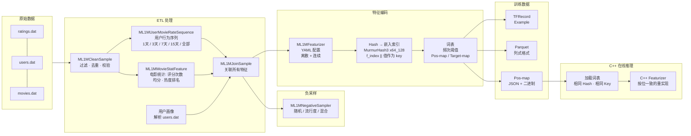
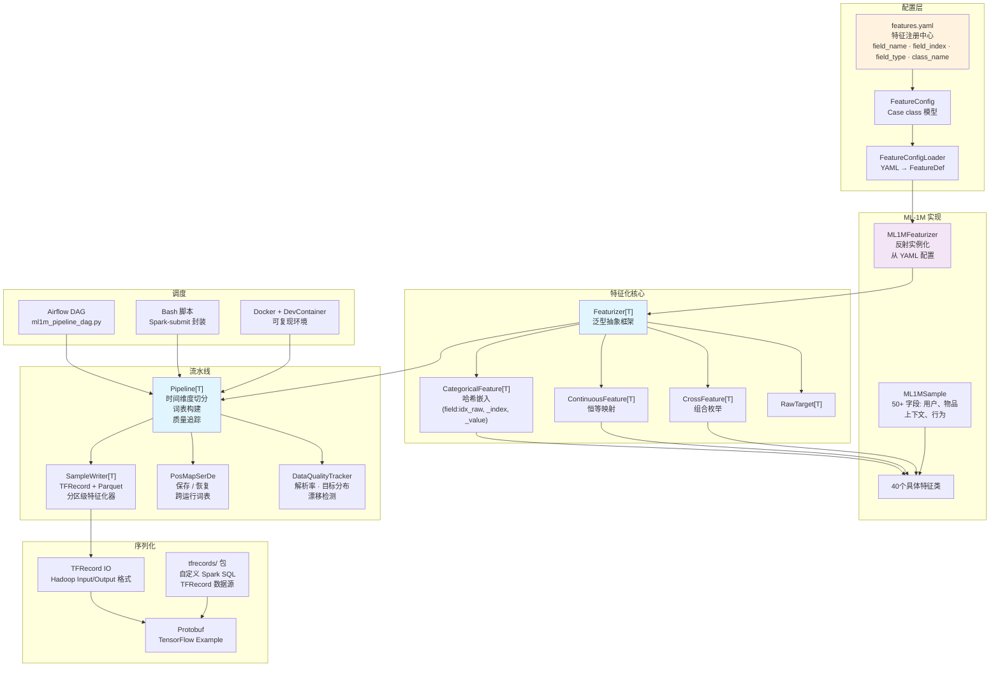

<p align="center">
  
</p>

# gerbil-data

[](LICENSE)
[](https://www.scala-lang.org/)
[](https://spark.apache.org/)
[](https://github.com/shardzhang/gerbil-data/actions/workflows/ci.yml)
[](https://codecov.io/gh/shardzhang/gerbil-data)

基于 Apache Spark 的生产级推荐系统特征工程 pipeline。处理原始用户-物品交互数据，通过 ETL pipeline 提取丰富特征（用户画像、物品属性、上下文信号、多时间窗口行为序列），输出 **TFRecord** 和 **Parquet** 格式的特征化训练样本，可直接用于 TensorFlow 深度学习模型训练。

目前支持 [MovieLens 1M (ML-1M)](https://grouplens.org/datasets/movielens/1m/) 数据集，模块化可扩展架构设计，便于适配其他数据集。

## 功能特性

1. **数据清洗与特征提取**: 将原始交互日志加工为结构化训练样本，这是推荐系统特征工程的基石。基于 Spark SQL 完成去重、异常过滤、多表特征 Join，各个阶段内置列级数据质量检查，杜绝"garbage in, garbage out"。提取用户画像、物品属性、上下文信号、可配置时间窗口的行为序列——覆盖推荐模型所需的完整特征谱系。支持多种预测目标: 多分类、二分类、回归
2. **负采样策略**: 为每条正样本生成该用户未交互的物品作为负样本，推荐系统排序模型训练的必备环节。支持均匀随机、流行度偏置采样、混合采样三种策略，防止热门物品主导训练梯度，有效缓解"马太效应"，提升模型对长尾物品的泛化能力。
3. **高阶交叉特征**: 支持二阶及以上高阶特征组合，捕捉数据中更深层模式。全部特征（60 个原始特征 + 17 个交叉特征）通过类型安全的泛型 `Featurizer[T]` 架构编码 —— 产出 DeepFM、DIN 等模型的标准 embedding lookup 格式。
4. **词表管理**: 基于频次阈值构建 embedding 词表，为每个特征分配独立位置。特征位置映射持久化为 JSON（人类可读）和二进制（含均值/标准差，用于在线归一化）。
5. **特征配置化**: YAML 驱动的特征注册中心。新增或禁用特征只需编辑一个配置文件，无需改代码、无需重编译。支持 classpath 和外部文件两种加载方式。
6. **多格式输出**：最终样本支持输出 TFRecord（TensorFlow Example protobuf）和 Parquet（列式存储）两种格式，按时间切分 train/val/test 用于通用推荐效果评估。
7. **数据质量监控**: 防范生产推荐系统的两大隐形杀手 —— 训练-服务不一致和数据漂移。ETL 层自动检测各阶段的空值率、基数、数值分布等列级指标；特征编码层追踪解析成功率和目标分布 Top-5。跨运行漂移检测自动对比历史基线，当总量波动、空值率变化、均值偏移超过预设阈值时发出告警。
8. **Pipline编排与调度**: 模式 Pipeline 执行引擎。Airflow DAG 用于生产调度，支持自动重试和监控；独立 Python 脚本用于本地开发和 CI。拓扑排序保证阶段执行顺序，`--dry-run` 模式支持执行计划预览。
9. **C++ 在线推理**:  与Scala 训练侧按位一致的 C++ 特征重实现，专为延迟敏感的在线推理场景设计。加载完全相同的词表二进制，执行完全相同的 MurmurHash3 和键拼接逻辑 —— 从根源上消除生产系统中训练-服务不一致的常见问题。正确性经数万行 golden data diff 验证。

## 项目架构

```
gerbil-data/
├── .devcontainer/               # DevContainer 可复现开发环境
├── assets/                      # 项目资源（logo 等）
├── bash/                        # 执行 pipeline 步骤的 Shell 脚本
│   ├── conf/                    # 环境配置
│   ├── pipeline/                # 训练样本生成脚本
│   │   └── eval/                #   离线评估
│   ├── processing/              # 数据预处理脚本
│   │   ├── clean/               #   数据清洗
│   │   ├── feature/             #   特征提取
│   │   ├── join/                #   特征关联
│   │   └── sampling/            #   负采样
│   ├── proto/                   # Protobuf 编译
│   └── tools/                   # 工具脚本
├── dag/                         # Pipeline DAG（Airflow + 独立运行）
│   ├── ml1m_pipeline_dag.py     # Airflow DAG 定义
│   └── run_pipeline.py          # 独立运行脚本（无需 Airflow）
├── docs/                        # 文档
├── proto/                       # TensorFlow Example protobuf 定义
├── sql/                         # Hive/Spark SQL 脚本
├── src/
│   ├── main/
│   │   ├── java/                # Java 工具类（TensorFlow Hadoop I/O）
│   │   ├── resources/           # 配置文件（features.yaml）
│   │   └── scala/
│   │       ├── config/          # 配置加载与解析
│   │       ├── processing/      # ETL：原始数据 → 平面中间表
│   │       │   ├── clean/       #   数据清洗与验证
│   │       │   ├── feature/     #   特征衍生（统计量、序列）
│   │       │   └── join/        #   多表特征关联
│   │       ├── featurizer/      # ML 编码：特征 → 嵌入索引
│   │       │   ├── core/        #   抽象特征化框架
│   │       │   └── ml1m/        #   ML-1M 具体实现
│   │       ├── pipeline/        # 编排与训练样本生成
│   │       │   ├── serde/       #   序列化（TFRecord、Parquet、pos-map）
│   │       │   └── stats/       #   在线统计（运行值、位置信息）
│   │       ├── tfrecords/       # 自定义 Spark SQL TFRecord 数据源
│   │       │   ├── serde/       #   序列化/反序列化
│   │       │   └── udf/         #   用户自定义函数
│   │       └── utils/           # 工具函数
│   └── test/                    # 单元测试（镜像 main 结构）
│       ├── scala/
│       │   ├── config/
│       │   ├── featurizer/
│       │   ├── pipeline/
│       │   ├── tfrecords/
│       │   └── utils/
│       └── resources/
├── tools/                       # C++ 在线推理特征编码器
│   └── cpp_featurizer/          #   按位一致的 C++ 重实现
├── Dockerfile                   # Docker 构建
├── pom.xml                      # Maven 构建配置
└── requirements.txt             # Python 依赖
```

### Pipeline 数据流



### 组件架构



## 前置要求

- **Java** 8+
- **Scala** 2.12
- **Maven** 3.x
- **Apache Spark** 3.4.0
- **protoc** 3.6.0（编译 protobuf 用，可选）

## Python 环境

为 Jupyter notebook 示例（`examples/gerbil-data-demo.ipynb`）和数据检查工具（`bash/tools/*.py`）配置 Python 虚拟环境。

```bash
cd $PROJECT_HOME
python3.11 -m venv .venv
source .venv/bin/activate
pip install -r requirements.txt
```

## 快速开始

### 1. 构建项目

```bash
mvn clean package -DskipTests
```

### 2. 查看 API 文档（Scaladoc）

```bash
mvn scala:doc
open target/site/scaladocs/index.html
```

### 3. 下载 ML-1M 数据集

```bash
curl -O https://files.grouplens.org/datasets/movielens/ml-1m.zip
unzip ml-1m.zip
# 为下面的命令设置环境变量
export ML1M_HOME=/path/to/unzipped/ml-1m
```

### 3. 运行 Pipeline

#### 步骤 1：清洗原始数据
```bash
spark-submit --class processing.clean.ML1MCleanSample \
  target/gerbil-data-1.0.0-jar-with-dependencies.jar \
  ${ML1M_HOME}
```

#### 步骤 2：提取用户行为序列
```bash
spark-submit --class processing.feature.ML1MUserMovieRateSequence \
  target/gerbil-data-1.0.0-jar-with-dependencies.jar \
  ${ML1M_HOME}
```

#### 步骤 3：计算电影统计特征
```bash
spark-submit --class processing.feature.ML1MMovieStatFeature \
  target/gerbil-data-1.0.0-jar-with-dependencies.jar \
  ${ML1M_HOME}
```

#### 步骤 4：关联所有特征
```bash
spark-submit --class processing.join.ML1MJoinSample \
  target/gerbil-data-1.0.0-jar-with-dependencies.jar \
  ${ML1M_HOME}
```

#### 步骤 5：生成 TFRecord / Parquet 样本
```bash
spark-submit --class pipeline.ML1MPipeline \
  --conf spark.serializer=org.apache.spark.serializer.JavaSerializer \
  target/gerbil-data-1.0.0-jar-with-dependencies.jar \
  --yesterday <date> \
  --parts <num_partitions> \
  --feature_threshold <threshold> \
  --target_threshold <threshold> \
  --sample_ratio <ratio> \
  --input_dir ${ML1M_HOME} \
  --output_dir /path/to/output \
  --output_format tfrecord \
  --target_mode binary
```

### 或使用 Shell 脚本运行

```bash
# 编辑 bash/conf/env.sh 配置你的路径
bash bash/processing/clean/ML1MCleanSample.sh
bash bash/processing/feature/ML1MMovieStatFeature.sh
bash bash/processing/feature/ML1MUserMovieRateSequence.sh
bash bash/processing/join/ML1MJoinSample.sh
bash bash/pipeline/ML1MPipeline.sh
```

## Docker / DevContainer

提供了一键构建的开发环境 Docker 镜像（Java 8、Scala 2.12、Maven、protoc、Python），确保开发环境可复现。

### 构建镜像

```bash
docker build -t gerbil-data .
```

### 交互式终端

```bash
docker run -it --rm -v "$PWD":/workspace gerbil-data bash
```

### 运行 Maven 命令

```bash
docker run --rm -v "$PWD":/workspace gerbil-data mvn compile -DskipTests
```

### VS Code DevContainer

1. 安装 **Dev Containers** 扩展
2. `Cmd+Shift+P` → **Dev Containers: Reopen in Container**
3. VS Code 自动构建并进入容器，Metals（Scala 语言服务器）和所有扩展已配置好

> Spark 未内置在镜像中以保持轻量，需要时在运行时挂载：
> `-v /path/to/spark:/opt/spark`

## 示例

Jupyter notebook 展示端到端 pipeline 流程：

```bash
jupyter notebook examples/gerbil-data-demo.ipynb
```

或使用 JupyterLab：

```bash
jupyter lab examples/gerbil-data-demo.ipynb
```

涵盖原始数据查看、ETL pipeline 执行、特征编码、TFRecord 输出检查和快速模型训练示例。

## 特征类型

### 原始特征

| 类别 | 特征 |
|------|------|
| 用户 | ID、性别、年龄、职业、邮编、评分次数、平均评分、评分方差、活跃天数 |
| 物品 | ID、标题、类型、类型数量、评分次数、平均评分、热度排名、上映年份 |
| 上下文 | 小时、时段（凌晨/上午/下午/晚上）、星期几、是否周末 |
| 行为 | 电影评分序列（全部/1天/3天/7天/15天）、类型评分序列 |

### 交叉特征（可配置）

- **二阶交叉**：类型 × 用户类型偏好、上映年份 × 年龄、热度 × 用户均分、类型 × 性别、类型 × 是否周末
- **三阶交叉**：年龄 × 性别 × 类型、上映年份 × 年龄 × 职业、类型 × 性别 × 职业

### 预测目标

通过 `--target_mode` 参数选择预测目标：

| 模式 | CLI 值 | 说明 |
|------|--------|------|
| **多分类** | `multi` | 评分（1-5）作为类别目标，使用 `target_map` 构建词表 |
| **二分类** | `binary` | 评分 >= 3 为正样本，< 3 为负样本；支持通过 `sample_ratio` 负采样下采样 |
| **回归** | `rating` | 原始评分值作为回归目标，禁用 `target_map`，直接输出浮点值 |

## 输出格式

### TFRecord
二进制 protobuf 记录，TensorFlow Example 格式，针对 TensorFlow 模型训练优化。

### Parquet
列式存储格式，兼容 Spark 及多种大数据工具。

### 词表文件
- `pos_map.json` — 人类可读的结构化特征位置映射
- `pos_map.bin` — 带均值/标准差的二进制特征映射，用于在线归一化
- `pos_map.txt` — 字段维度汇总文本文件

## 特征配置

特征通过 YAML 注册（`src/main/resources/ml1m/features.yaml`），每个特征条目包含以下字段：

| 键 | 说明 |
|-----|-------------|
| `field_name` | 全局唯一的特征名（作为 TFRecord 字段前缀） |
| `field_index` | 数字索引；相同 `field_index` 的特征共享同一个 embedding 词表 |
| `field_type` | `1` 为离散特征（哈希映射），`0` 为连续特征（恒等映射） |
| `class_name` | 实现特征提取逻辑的 Scala 类名 |
| `enabled` | 是否启用（`true`/`false`） |

```yaml
features:
  - {field_name: user_id,       field_index: 1,   field_type: 1, class_name: UserID,       enabled: true}
  - {field_name: user_age,      field_index: 2,   field_type: 1, class_name: UserAge,      enabled: true}
  - {field_name: movie_id,      field_index: 101, field_type: 1, class_name: MovieID,      enabled: true}
  - {field_name: movie_title,   field_index: 102, field_type: 1, class_name: MovieTitle,   enabled: true}

  # 行为序列共享 field_index 101（与 movie_id 共用词表）
  - {field_name: user_movie_rate,    field_index: 101, field_type: 1, class_name: UserMovieRate,    enabled: true}
  - {field_name: user_movie_rate_1day, field_index: 101, field_type: 1, class_name: UserMovieRate1Day, enabled: true}
```

### 词表共享

相同 `field_index` 的特征共享同一张 embedding 词表（pos-map）。位置计数器在所有使用该 `field_index` 的特征间统一，确保每个唯一特征值获得独立的 embedding 槽位——即使该值出现在多个关联特征中。

例如 `movie_id`、`user_movie_rate`、`user_movie_rate_1day` 共享 `field_index=101`。"Toy Story" 无论作为目标物品、用户近 1 天行为还是全量历史出现，都映射到同一个 embedding 位置。这实现了参数共享和跨特征泛化。

### 字段命名规范

每个特征在 TFRecord 中产出三个字段：
- `{field_name}_raw` — 原始字符串表示
- `{field_name}_index` — 嵌入位置（pos-map 查找或哈希映射）
- `{field_name}_value` — 嵌入权重（如类型偏好特征中为该类型的平均评分）

## 项目模块

| 模块 | 说明 |
|------|------|
| `processing` | ETL pipeline：数据清洗、特征衍生、多表关联 |
| `sampling` | CTR 负采样（随机 / 流行度 / 混合） |
| `featurizer` | ML 特征编码：类别/连续/交叉特征，哈希/PosMap 嵌入 |
| `pipeline` | 编排：样本生成、词表管理、TFRecord/Parquet 输出 |
| `config` | YAML 驱动特征配置（SnakeYAML → Scala case class） |
| `tfrecords` | 自定义 Spark SQL TFRecord 数据源 |
| `utils` | 日志、MurmurHash3、日期工具、protobuf 辅助 |
| `dag` | 编排层：Airflow DAG（生产）+ 独立 Python 脚本（CI/开发） |
| `bash` | Spark-submit 封装脚本与环境配置 |
| `sql` | Hive DDL 持久化表定义 |
| `proto` | TensorFlow Example protobuf 定义 |
| `tools` | C++ 在线推理特征处理器 + golden data 生成器 |

## 依赖项

- **Apache Spark** 3.4.0 (core, sql, mllib, hive)
- **Scala** 2.12.17
- **Protobuf** 3.6.0
- **Hadoop** 3.3.4
- **TensorFlow Hadoop**（内嵌，用于 TFRecord I/O）

## 贡献指南

欢迎贡献！请阅读 [CONTRIBUTING.md](CONTRIBUTING.md) 了解详情。

## 许可证

本项目基于 MIT 许可证开源 — 详见 [LICENSE](LICENSE) 文件。

## 参考资料

- [MovieLens 1M 数据集](https://grouplens.org/datasets/movielens/1m/)
- [TensorFlow Example 协议](https://github.com/tensorflow/tensorflow/tree/master/tensorflow/core/example)
- [TensorFlow Hadoop](https://github.com/tensorflow/ecosystem/tree/master/hadoop)
- [Spark TensorFlow Connector](https://github.com/tensorflow/ecosystem/tree/master/spark/spark-tensorflow-connector)
