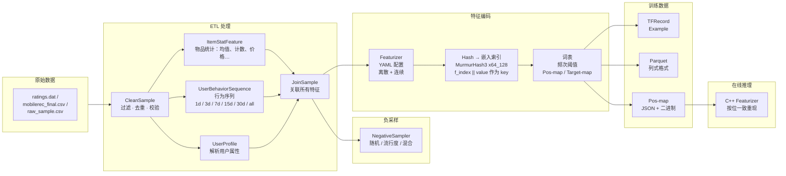
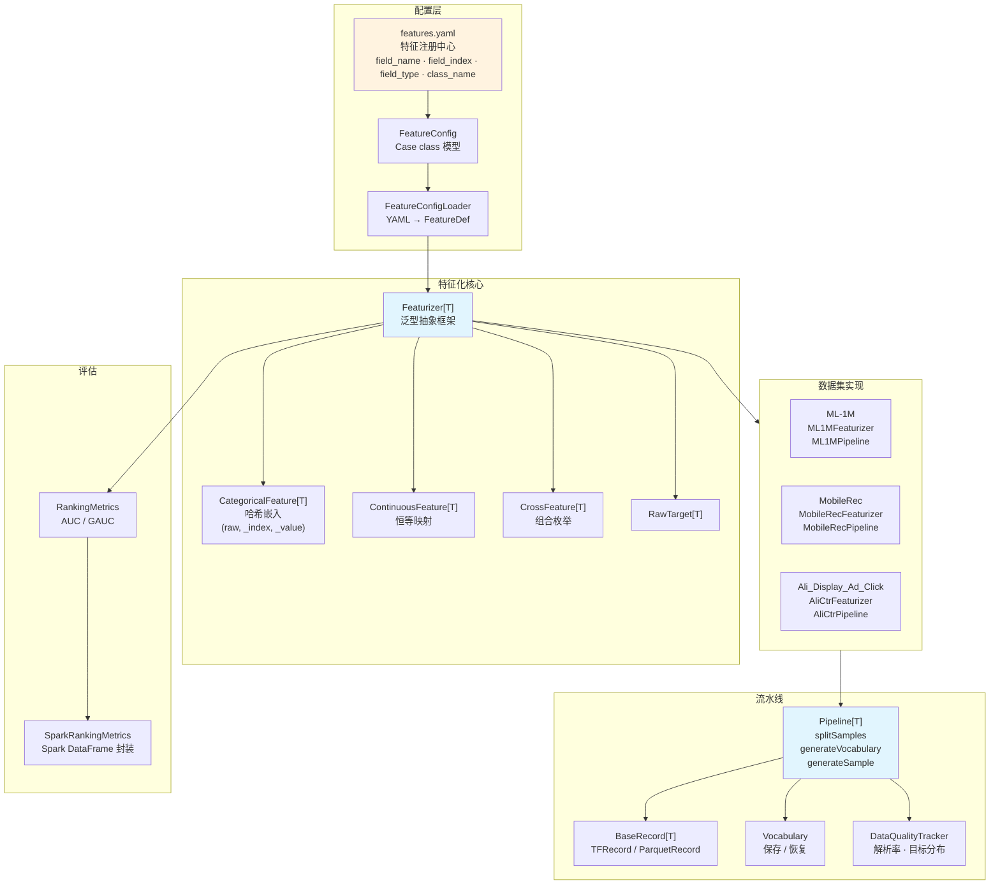

<p align="center">
  
</p>

# gerbil-data

[](LICENSE)
[](https://www.scala-lang.org/)
[](https://spark.apache.org/)
[](https://github.com/shardzhang/gerbil-data/actions/workflows/ci.yml)
[](https://codecov.io/gh/shardzhang/gerbil-data)

基于 Apache Spark 的生产级推荐系统特征工程 pipeline。处理原始用户-物品交互数据，通过 ETL pipeline 提取丰富特征（用户画像、物品属性、上下文信号、多时间窗口行为序列），输出 **TFRecord** 和 **Parquet** 格式的特征化训练样本，可直接用于 TensorFlow 深度学习模型训练。

目前支持 **三个数据集**，模块化可扩展架构：

| 数据集 | 领域 | 规模（交互数） | 标签 |
|--------|------|---------------|------|
| [MovieLens 1M (ML-1M)](https://grouplens.org/datasets/movielens/1m/) | 电影评分 | 100 万 | rating >= 4 → 二分类 / 多分类 / 回归 |
| [MobileRec](https://github.com/mhmaqbool/mobilerec) | App 推荐 | 1930 万 | rating >= 4 → 二分类 |
| [Ali_Display_Ad_Click](https://tianchi.aliyun.com/dataset/56) | 展示广告 CTR | 2656 万 | 原生点击 (0/1) |

## 功能特性

1. **数据清洗与特征提取**: 将原始交互日志加工为结构化训练样本，这是推荐系统特征工程的基石。基于 Spark SQL 完成去重、异常过滤、多表特征 Join，各个阶段内置列级数据质量检查，杜绝"garbage in, garbage out"。提取用户画像、物品属性、上下文信号、可配置时间窗口的行为序列——覆盖推荐模型所需的完整特征谱系。支持多种预测目标: 多分类、二分类、回归。已内置支持 ML-1M、MobileRec、Ali_Display_Ad_Click 三个数据集。
2. **负采样策略**: 为每条正样本生成该用户未交互的物品作为负样本，推荐系统排序模型训练的必备环节。支持均匀随机、流行度偏置采样、混合采样三种策略，防止热门物品主导训练梯度，有效缓解"马太效应"，提升模型对长尾物品的泛化能力。（当前已为 ML-1M 实现。）
3. **高阶交叉特征**: 支持二阶及以上高阶特征组合，捕捉数据中更深层模式。全部特征（ML-1M 为 60 个原始特征 + 17 个交叉特征）通过类型安全的泛型 `Featurizer[T]` 架构编码 —— 产出 DeepFM、DIN、Wide&Deep 等模型的标准 embedding lookup 格式。交叉特征可通过 YAML 按数据集配置。
4. **词表管理**: 基于频次阈值构建 embedding 词表，为每个特征分配独立位置。特征位置映射持久化为 JSON（人类可读）和二进制（含均值/标准差，用于在线归一化）。支持跨运行增量更新，相同 `field_index` 的特征可共享词表。
5. **特征配置化**: YAML 驱动的特征注册中心。新增或禁用特征只需编辑一个配置文件，无需改代码、无需重编译。支持 classpath 和外部文件两种加载方式。每个数据集有独立的 YAML 配置和模式变体（binary/multi）。
6. **多格式输出**：最终样本支持输出 TFRecord（TensorFlow Example protobuf）和 Parquet（列式存储）两种格式，按时间切分 train/val/test 用于通用推荐效果评估。
7. **数据质量监控**: 防范生产推荐系统的两大隐形杀手 —— 训练-服务不一致和数据漂移。ETL 层自动检测各阶段的空值率、基数、数值分布等列级指标；特征编码层追踪解析成功率和目标分布 Top-5。跨运行漂移检测自动对比历史基线，当总量波动、空值率变化、均值偏移超过预设阈值时发出告警。
8. **Pipeline 编排与调度**: 泛型 `Pipeline[T]` 抽象类，按 `splitSamples` → `generateVocabulary` → `generateSample` 三个阶段编排。Airflow DAG 用于生产调度，支持自动重试和监控；独立 Python 脚本用于本地开发和 CI。拓扑排序保证阶段执行顺序，`--dry-run` 模式支持执行计划预览。
9. **C++ 在线推理**:  与Scala 训练侧按位一致的 C++ 特征重实现，专为延迟敏感的在线推理场景设计。加载完全相同的词表二进制，执行完全相同的 MurmurHash3 和键拼接逻辑 —— 从根源上消除生产系统中训练-服务不一致的常见问题。正确性经数万行 golden data diff 验证。
10. **AUC / GAUC 评估**: 内置离线模型评估指标。纯 Scala 的 `RankingMetrics`（无 Spark 依赖）基于 Mann-Whitney U 统计量实现 AUC，按样本数加权计算 GAUC。`SparkRankingMetrics` 提供 DataFrame CLI 封装，支持 Parquet、CSV、TFRecord 格式的预测结果评估。

## 项目架构

```
gerbil-data/
├── .devcontainer/               # DevContainer 可复现开发环境
├── assets/                      # 项目资源（logo 等）
├── bash/                        # 执行 pipeline 步骤的 Shell 脚本
│   ├── conf/                    # 环境配置
│   ├── pipeline/                # 训练样本生成脚本
│   │   └── eval/                #   离线评估（AUC / GAUC）
│   ├── processing/              # 数据预处理脚本
│   │   ├── clean/               #   数据清洗（各数据集）
│   │   ├── feature/             #   特征提取（各数据集）
│   │   ├── join/                #   特征关联（各数据集）
│   │   ├── sampling/            #   负采样
│   │   ├── proto/               #   Protobuf 编译
│   │   └── tools/               #   工具脚本
│   └── pipeline/                # Pipeline Shell 脚本
├── dag/                         # Pipeline DAG（Airflow + 独立运行）
│   ├── ml1m_pipeline_dag.py     #   Airflow DAG 定义
│   └── run_pipeline.py          #   独立运行脚本（无需 Airflow）
├── docs/                        # 文档
│   └── dataset/
│       ├── ml_1m/               # ML-1M 数据集说明
│       └── mobile_rec/          # MobileRec 数据集说明
├── proto/                       # TensorFlow Example Protobuf 定义
├── sql/                         # Hive/Spark SQL 脚本
├── src/
│   ├── main/
│   │   ├── java/                # Java 工具（TensorFlow Hadoop I/O）
│   │   ├── resources/           # 配置文件
│   │   │   ├── ml1m/            #   ML-1M YAML 配置
│   │   │   ├── mobilerec/       #   MobileRec YAML 配置
│   │   │   └── alictr/          #   Ali_Display_Ad_Click YAML 配置
│   │   └── scala/
│   │       ├── config/          # 配置加载与解析
│   │       ├── processing/      # ETL：原始数据 → 扁平化中间表
│   │       │   ├── clean/       #   数据清洗（ML1M/MobileRec/AliCtr）
│   │       │   ├── feature/     #   特征衍生（各数据集）
│   │       │   ├── join/        #   多表关联（各数据集）
│   │       │   └── sampling/    #   负采样
│   │       ├── featurizer/      # ML 编码：特征 → 嵌入索引
│   │       │   ├── Featurizer.scala              #   泛型特征化抽象框架
│   │       │   ├── RawFeature.scala              #   特征基类
│   │       │   ├── RawTarget.scala               #   目标特征基类
│   │       │   ├── CategoricalFeature.scala      #   离散特征哈希编码器
│   │       │   ├── ContinuousFeature.scala       #   连续特征恒等映射编码器
│   │       │   ├── CrossFeature.scala            #   交叉特征组合编码器
│   │       │   ├── ml1m/        #   ML-1M 特征实现
│   │       │   ├── mobilerec/   #   MobileRec 特征实现
│   │       │   └── alictr/      #   AliCtr 特征实现
│   │       ├── pipeline/        # 编排与训练样本生成
│   │       │   ├── Pipeline.scala                #   Pipeline 抽象基类
│   │       │   ├── ML1MPipeline.scala            #   ML-1M 驱动
│   │       │   ├── MobileRecPipeline.scala       #   MobileRec 驱动
│   │       │   ├── AliCtrPipeline.scala          #   Ali_Display_Ad_Click 驱动
│   │       │   ├── serde/       #   序列化（TFRecord、Parquet、词表映射）
│   │       │   │   ├── BaseRecord.scala            #   写入器抽象基类
│   │       │   │   ├── TFRecord.scala              #   TFRecord (Example) 写入器
│   │       │   │   ├── ParquetRecord.scala         #   Parquet 列式写入器 + 数据模型
│   │       │   │   └── Vocabulary.scala            #   词表（pos-map / target-map）持久化
│   │       │   ├── stats/       #   在线统计
│   │       │   └── eval/        #   AUC / GAUC 评估
│   │       ├── tfrecords/       # 自定义 Spark SQL TFRecord 数据源
│   │       └── utils/           # 工具函数
│   └── test/                    # 单元测试（与 main 结构对应）
├── tools/                       # C++ 在线推理特征处理器
│   └── cpp_featurizer/          #   按位一致的 C++ 重实现
├── Dockerfile                   # Docker 构建
├── pom.xml                      # Maven 构建配置
└── requirements.txt             # Python 依赖
```

### Pipeline 数据流


```mermaid
flowchart LR
    subgraph Raw["原始数据"]
        direction TB
        R1["ratings.dat /<br/>mobilerec_final.csv /<br/>raw_sample.csv"]
    end

    subgraph ETL["ETL 处理"]
        C["CleanSample<br/>过滤 · 去重 · 校验"]
        S["ItemStatFeature<br/>物品统计：均值、计数、价格…"]
        B["UserBehaviorSequence<br/>行为序列<br/>1d / 3d / 7d / 15d / 30d / all"]
        P["UserProfile<br/>解析用户属性"]
        J["JoinSample<br/>关联所有特征"]
    end

    subgraph Sampling["负采样"]
        N["NegativeSampler<br/>随机 / 流行度 / 混合"]
    end

    subgraph Encoding["特征编码"]
        F["Featurizer<br/>YAML 配置<br/>离散 + 连续"]
        H["Hash → 嵌入索引<br/>MurmurHash3 x64_128<br/>f_index || value 作为 key"]
        V["词表<br/>频次阈值<br/>Pos-map / Target-map"]
    end

    subgraph Train["训练数据"]
        T["TFRecord<br/>Example"]
        Pq["Parquet<br/>列式格式"]
        Pm["Pos-map<br/>JSON + 二进制"]
    end

    subgraph Serve["在线推理"]
        Cp["C++ Featurizer<br/>按位一致重现"]
    end

    Raw --> C --> S & B & P --> J
    J --> N & F
    F --> H --> V
    V --> T & Pq & Pm
    Pm --> Cp
```

### 组件架构


```mermaid
flowchart TD
    subgraph Config["配置层"]
        YAML["features.yaml<br/>特征注册中心<br/>field_name · field_index · field_type · class_name"]
        FC["FeatureConfig<br/>Case class 模型"]
        CL["FeatureConfigLoader<br/>YAML → FeatureDef"]
    end

    subgraph Core["特征化核心"]
        FE["Featurizer[T]<br/>泛型抽象框架"]
        CF["CategoricalFeature[T]<br/>哈希嵌入<br/>(raw, _index, _value)"]
        COF["ContinuousFeature[T]<br/>恒等映射"]
        XF["CrossFeature[T]<br/>组合枚举"]
        RT["RawTarget[T]"]
    end

    subgraph DS["数据集实现"]
        M1["ML-1M<br/>ML1MFeaturizer<br/>ML1MPipeline"]
        MR["MobileRec<br/>MobileRecFeaturizer<br/>MobileRecPipeline"]
        AL["Ali_Display_Ad_Click<br/>AliCtrFeaturizer<br/>AliCtrPipeline"]
    end

    subgraph Pipe["流水线"]
        PL["Pipeline[T]<br/>splitSamples<br/>generateVocabulary<br/>generateSample"]
        BR["BaseRecord[T]<br/>TFRecord / ParquetRecord"]
        VS["Vocabulary<br/>保存 / 恢复"]
        QT["DataQualityTracker<br/>解析率 · 目标分布"]
    end

    subgraph Eval["评估"]
        RM["RankingMetrics<br/>AUC / GAUC"]
        SR["SparkRankingMetrics<br/>Spark DataFrame 封装"]
    end

    YAML --> FC --> CL --> FE
    FE --> CF & COF & XF & RT
    FE --> DS
    DS --> PL
    PL --> BR & VS & QT
    FE --> RM --> SR

    style FE fill:#e1f5fe
    style PL fill:#e1f5fe
    style YAML fill:#fff3e0
```

## 数据集

### ML-1M

100 万电影评分，6040 用户，3706 电影。含用户画像（性别/年龄/职业）、物品属性（标题/类型/年份）、多窗口行为序列和上下文特征。

**ETL 流程**（按顺序执行）：

| 步骤 | 脚本 | 类 | 说明 |
|------|------|-----|------|
| 1 | `bash/processing/clean/ML1MCleanSample.sh` | `processing.clean.ML1MCleanSample` | 清洗去重评分数据 |
| 2 | `bash/processing/feature/ML1MUserMovieRateSequence.sh` | `processing.feature.ML1MUserMovieRateSequence` | 构建用户行为序列 |
| 3 | `bash/processing/feature/ML1MMovieStatFeature.sh` | `processing.feature.ML1MMovieStatFeature` | 计算电影统计特征 |
| 4 | `bash/processing/join/ML1MJoinSample.sh` | `processing.join.ML1MJoinSample` | 关联所有特征 |
| 5 | `bash/pipeline/ML1MPipelineBinary.sh` | `pipeline.ML1MPipeline` | 生成 TFRecord / Parquet |

### MobileRec

1930 万 App 交互，70 万用户，1 万 App。基于评分，含商店元数据（分类/价格/评论数/内容分级）。

**ETL 流程**（按顺序执行）：

| 步骤 | 脚本 | 类 |
|------|------|-----|
| 1 | `bash/processing/clean/MobileRecCleanSample.sh` | `processing.clean.MobileRecCleanSample` |
| 2 | `bash/processing/feature/MobileRecAppStatFeature.sh` | `processing.feature.MobileRecAppStatFeature` |
| 3 | `bash/processing/feature/MobileRecUserBehaviorSequence.sh` | `processing.feature.MobileRecUserBehaviorSequence` |
| 4 | `bash/processing/join/MobileRecJoinSample.sh` | `processing.join.MobileRecJoinSample` |
| 5 | `bash/pipeline/MobileRecPipelineBinary.sh` | `pipeline.MobileRecPipeline` |

### Ali_Display_Ad_Click（AliCtr）

2656 万展示广告曝光，114 万用户，84.7 万广告组。原生点击标签（0/1），含用户画像（性别/年龄/购物力）和广告层级（活动/广告主/品牌/类目）。

**ETL 流程**（按顺序执行）：

| 步骤 | 脚本 | 类 |
|------|------|-----|
| 1 | `bash/processing/clean/AliCtrCleanSample.sh` | `processing.clean.AliCtrCleanSample` |
| 2 | `bash/processing/feature/AliCtrItemStatFeature.sh` | `processing.feature.AliCtrItemStatFeature` |
| 3 | `bash/processing/feature/AliCtrUserProfileFeature.sh` | `processing.feature.AliCtrUserProfileFeature` |
| 4 | `bash/processing/feature/AliCtrUserBehaviorSequence.sh` | `processing.feature.AliCtrUserBehaviorSequence` |
| 5 | `bash/processing/feature/AliCtrJoinSample.sh` | `processing.feature.AliCtrJoinSample` |
| 6 | `bash/pipeline/AliCtrPipelineBinary.sh` | `pipeline.AliCtrPipeline` |

## 评估

rank 指标位于 `pipeline.eval` 包：

| 类 | 说明 |
|-------|-------------|
| `RankingMetrics` | 纯 Scala AUC / GAUC 计算，无 Spark 依赖 |
| `SparkRankingMetrics` | Spark DataFrame 封装，支持 CLI 入口 |

```bash
# 评估模型预测结果（Parquet 格式，含 target + score 列）
bash bash/pipeline/eval/RankingMetrics.sh
```

## 快速开始

### 1. 构建项目

```bash
mvn clean package -DskipTests
```

### 2. 下载数据集

```bash
# ML-1M
curl -O https://files.grouplens.org/datasets/movielens/ml-1m.zip && unzip ml-1m.zip

# MobileRec / Ali_Display_Ad_Click（详见 docs/dataset/）
```

### 3. 编辑环境配置

```bash
# 根据你的路径修改 bash/conf/env.sh
# 主要配置：数据路径、Spark 安装目录
```

### 4. 运行 Pipeline

```bash
source bash/conf/env.sh

# ML-1M
bash bash/processing/clean/ML1MCleanSample.sh
bash bash/processing/feature/ML1MUserMovieRateSequence.sh
bash bash/processing/feature/ML1MMovieStatFeature.sh
bash bash/processing/join/ML1MJoinSample.sh
bash bash/pipeline/ML1MPipelineBinary.sh

# MobileRec
bash bash/processing/clean/MobileRecCleanSample.sh
bash bash/processing/feature/MobileRecAppStatFeature.sh
bash bash/processing/feature/MobileRecUserBehaviorSequence.sh
bash bash/processing/join/MobileRecJoinSample.sh
bash bash/pipeline/MobileRecPipelineBinary.sh

# AliCtr
bash bash/processing/clean/AliCtrCleanSample.sh
bash bash/processing/feature/AliCtrItemStatFeature.sh
bash bash/processing/feature/AliCtrUserProfileFeature.sh
bash bash/processing/feature/AliCtrUserBehaviorSequence.sh
bash bash/processing/feature/AliCtrJoinSample.sh
bash bash/pipeline/AliCtrPipelineBinary.sh
```

## 特征类型

### 原始特征

| 类别 | ML-1M | MobileRec | AliCtr |
|------|-------|-----------|--------|
| 用户 | 性别/年龄/职业/评分统计 | 行为统计（活跃天/均分/方差） | cms_segid/性别/年龄/消费力/购物力/职业 |
| 物品 | 标题/类型/评分次/均分/热度/年份 | 包名/分类/价格/均分/评论数/内容分级 | 广告ID/类目/活动/客户/品牌/价格 |
| 上下文 | 小时/时段/星期 | 小时/时段/星期 | 广告位(pid)/小时/时段/星期 |
| 行为 | 电影评分序列(多窗口)、类型序列 | App评分序列(多窗口)、分类序列 | 广告曝光点击序列 |

### 交叉特征（每个数据集可配）

在各自的 YAML 配置中定义，如 `category_xx_user_category`、`gender_xx_age` 等。

## 数据切分方法

Pipeline 支持两种 train/val/test 切分策略，通过在 `Pipeline` 子类中覆写 `useLeaveOneOut` 选择（默认 `false`，即时序比例切分）。

### 时序比例切分（`useLeaveOneOut = false`，默认）

样本按时间戳全局排序后按比例切分：

```
train = 前 80%（按数量，时间最早）
val   = 中间 10%
test  = 后 10%（时间最新）
```

**适用场景：**

| 任务 | 原因 |
|------|--------|
| CTR 预估（二分类） | 在**未来数据**上评估模型——模拟线上推理场景。防止跨用户时间泄漏（用户 B 的未来样本不会出现在用户 A 的训练集中）。 |
| 评分回归 | 同上——点式预测任务要求训练和测试之间有严格的时间墙。 |
| 任何时间敏感的评估 | 当时间顺序重要，评估目标是泛化到未来时间窗口时。 |

**优缺点：**

- ✅ 训练与测试间严格时间隔离——未来数据不会泄漏到训练集
- ✅ 简单且确定性
- ❌ 只有晚期交互数据的用户可能不出现在训练集中
- ❌ 不评估每个用户的排序性能

### Leave-One-Out 切分（`useLeaveOneOut = true`）

对每个用户，交互按时间戳排序。最后一个交互作为 **test**，倒数第二个作为 **val**，其余作为 **train**：

```
用户 A: [t1, t2, t3, t4, t5]  →  train: t1-t3,  val: t4,  test: t5
用户 B: [t1, t2]              →  val: t1,        test: t2          (无 train)
用户 C: [t1]                  →  test: t1                          (无 train, 无 val)
```

**适用场景：**

| 任务 | 原因 |
|------|--------|
| 物品推荐（多分类） | 评估每个用户的 Top-N 排序性能——推荐系统论文的标准评估协议。 |
| 用户级泛化 | 每个用户贡献一个测试交互，可计算 HitRate@K、NDCG@K 等 per-user 指标。 |
| 冷启动模拟 | 交互少的用户可测试模型利用有限历史进行推荐的能力。 |

**优缺点：**

- ✅ 每个用户都出现在测试集中——支持 per-user 排序评估
- ✅ 推荐系统文献中广泛采用
- ❌ **跨用户时间泄漏**——用户 A 的测试样本（时间戳 t5）可能早于用户 B 的训练样本（时间戳 t6..tn），这意味着"未来"（用户 B）的信息泄漏到了训练数据中。这对排序评估可接受，但 CTR/回归不适用。
- ❌ 只有 1-2 条交互的用户没有有意义的训练集
- ❌ 不适用于需要时间隔离的 pointwise 任务（CTR、回归）

### 总结

| | 时序比例 | Leave-One-Out |
|--|-----------|---------------|
| **时间隔离** | ✅ 严格 | ❌ 跨用户泄漏 |
| **Per-user 评估** | ❌ | ✅ 每个用户都在测试集 |
| **CTR / 回归** | ✅ **推荐** | ❌ |
| **Top-N 推荐** | 可接受 | ✅ **推荐** |
| **引用** | — | RecSys 论文标准协议 [[1](#参考资料)] |

### 实现方式

通过在 `Pipeline` 子类中覆写 `useLeaveOneOut` 选择切分方式。启用 LOO 时需同时实现 `parseUserId(sample)` 返回每个样本的唯一用户标识。

```scala
// ML1MPipeline.scala
override def useLeaveOneOut: Boolean = true    // 启用 LOO
override def parseUserId(sample: ML1MSample): String = sample.user_id
```

```scala
// Pipeline.scala（默认——时序比例切分）
def useLeaveOneOut: Boolean = false
def parseUserId(sample: T): String
```

## 输出格式

### TFRecord
二进制 protobuf 记录，TensorFlow Example 格式，为 TensorFlow 模型训练优化。

### Parquet
列式存储格式，兼容 Spark 及众多大数据工具。

### 词表文件
- `pos_map.json` — 人类可读的结构化特征位置映射
- `pos_map.bin` — 二进制特征映射，含均值/标准差用于在线归一化
- `pos_map.txt` — 纯文本字段维度摘要

### 预测目标

运行 pipeline 时通过 `--target_mode` 选择预测目标：

| 模式 | CLI 参数 | ML-1M | MobileRec / AliCtr |
|------|-----------|-------|--------------------|
| **二分类** | `binary` | rating >= 3 → positive | rating >= 4 → positive / 原生 clk |
| **多分类** | `multi` | 评分 1-5 作为类别 | app/adgroup_id 作为类别 |
| **回归** | `rating` | 原始评分值 | N/A |

## 特征配置

特征通过 YAML 注册（`src/main/resources/{dataset}/*.yaml`）。每个特征条目包含以下字段：

| 字段 | 说明 |
|-----|-------------|
| `field_name` | 全局唯一的特征名（用作 TFRecord 字段前缀） |
| `field_index` | 数值索引；共享同一 `field_index` 的特征共享 embedding 词表 |
| `field_type` | `1` 为离散（哈希），`0` 为连续（恒等映射） |
| `class_name` | 实现特征提取逻辑的 Scala 类名 |
| `enabled` | 是否启用（`true`/`false`） |

```yaml
features:
  - {field_name: user_id,       field_index: 1,   field_type: 1, class_name: UserID,       enabled: true}
  - {field_name: user_age,      field_index: 2,   field_type: 1, class_name: UserAge,      enabled: true}
  - {field_name: movie_id,      field_index: 101, field_type: 1, class_name: MovieID,      enabled: true}

  # 行为序列共享 field_index 101（与 movie_id 共享同一词表）
  - {field_name: user_movie_rate,    field_index: 101, field_type: 1, class_name: UserMovieRate,    enabled: true}
```

### 共享词表

同一 `field_index` 的特征共享一份 embedding 词表（pos-map）。位置计数器在共享该 `field_index` 的所有特征上统一递增，确保每个唯一特征值获得唯一嵌入槽位——即使该值出现在多个关联特征中。

例如，AliCtr 中的 `adgroup_id`、`user_history_ad_seq` 都共享 `field_index=101`。广告 "12345" 映射到相同嵌入位置，不论它出现在目标广告位还是用户历史序列中。

### 字段命名约定

每个特征在 TFRecord 中产出三个字段：
- `{field_name}_raw` — 原始字符串
- `{field_name}_index` — 嵌入位置（词表查找或哈希）
- `{field_name}_value` — 嵌入权重

## 项目模块

| 模块 | 说明 |
|--------|-------------|
| `processing` | ETL pipeline：数据清洗、特征衍生、多表关联 |
| `featurizer` | ML 特征编码：离散/连续/交叉 featurizer，哈希/词表嵌入 |
| `pipeline` | 编排：样本生成、词表管理、TFRecord/Parquet 输出 |
| `pipeline.eval` | 排序指标：AUC / GAUC 计算（纯 Scala + Spark 封装） |
| `config` | YAML 驱动的特征配置（SnakeYAML → Scala case class） |
| `tfrecords` | 自定义 Spark SQL TFRecord 数据源 |
| `utils` | 日志、MurmurHash3、日期工具 |
| `dag` | Pipeline 编排：Airflow DAG（生产） + 独立 Python 脚本（CI/开发） |
| `bash` | Spark-submit 封装脚本与环境配置 |
| `tools` | C++ 在线推理特征处理器 + golden data 生成器 |

## 先决条件

- **Java** 8+
- **Scala** 2.12
- **Maven** 3.x
- **Apache Spark** 3.4.0
- **protoc** 3.6.0（用于 protobuf 编译，可选）

## Python 环境

```bash
cd $PROJECT_HOME
python3.11 -m venv .venv
source .venv/bin/activate
pip install -r requirements.txt
```

## Docker / DevContainer

```bash
docker build -t gerbil-data .
docker run -it --rm -v "$PWD":/workspace gerbil-data bash
```

## 依赖

- **Apache Spark** 3.4.0 (core, sql, mllib, hive)
- **Scala** 2.12.17
- **Protobuf** 3.6.0
- **Hadoop** 3.3.4
- **TensorFlow Hadoop**（内嵌，用于 TFRecord I/O）

## 贡献

欢迎贡献！详见 [CONTRIBUTING.md](CONTRIBUTING.md)。

## 许可证

MIT License — 详见 [LICENSE](LICENSE) 文件。

## 参考资料

- [MovieLens 1M Dataset](https://grouplens.org/datasets/movielens/1m/)
- [MobileRec: A Large-Scale Dataset for Mobile Apps Recommendation](https://arxiv.org/abs/2303.06588)
- [Ali_Display_Ad_Click Dataset](https://tianchi.aliyun.com/dataset/56)
- [TensorFlow Example Protocol](https://github.com/tensorflow/tensorflow/tree/master/tensorflow/core/example)
- [TensorFlow Hadoop](https://github.com/tensorflow/ecosystem/tree/master/hadoop)
- [Spark TensorFlow Connector](https://github.com/tensorflow/ecosystem/tree/master/spark/spark-tensorflow-connector)
